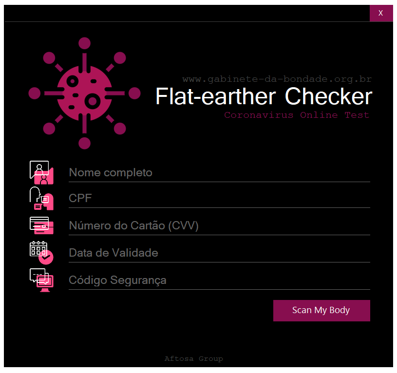

# UX_CoronaChecker
> Ux studies with C#


[](https://docs.microsoft.com/pt-br/visualstudio/get-started/csharp/?view=vs-2019)
[](https://docs.microsoft.com/pt-br/visualstudio/get-started/csharp/?view=vs-2019)
[]()

```
THIS PROJECT IS JOKE!
+------------------------------------------------------------------------------+
|  [!] Legal disclaimer: Usage of afdWordpress for attacking                   |
|  targets without prior mutual consent is illegal.                            |
|  It is the end user's responsibility to obey all applicable                  | 
|  local, state and federal laws.                                              |
|  Developers assume no liability and are not responsible for any misuse or    |
|  damage caused by this program                                               |
+------------------------------------------------------------------------------+
```

```
 + Autor: MrCl0wn
 + Blog: http://blog.mrcl0wn.com
 + GitHub: https://github.com/MrCl0wnLab
 + Twitter: https://twitter.com/MrCl0wnLab
 + Email: mrcl0wnlab\@\gmail.com
```

## PRINT FORM


## 
